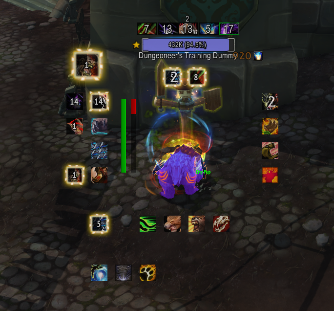

WeakAuraAutomationTool

This currently produces some weak auras. These weak auras are much better than 'no weakauras', but this is a long
term project. If you would like to try out the produced aura and provide some feedback, that'd be nice.
The 1st pass is focused on more of getting the tool to be 80% of what is needed.

The 2nd pass will work on additional polish, with more focus on the auras (vs. the tool that makes them).
Some aura icons are likely placed in-correctly because I do not know all the rotations for all the specs.
Most of the 2nd pass aura functionality tasks are things that I've done before this tool, but the 
tool doesn't have functions to generate them yet.

I built a lot of WeakAuras and there was a lot of overhead involved in tweaking things, that quickly
grows virally across all the characters I played. This tool exists to eliminate that.

Adding this macro to your toolbar will allow you to toggle all auras visible / invisible.

`/run local cvar='BarbequeWeakaurasVisibilityToggle' SetCVar(cvar,1-GetCVar(cvar),cvar`

Current (WIP) [Import String](ImportStrings/importString.txt) can be found [here](ImportStrings/).
The [resource hud](ImportStrings/resourceHud.txt) will be integrated at a later date.

The general concept is:
* Alerts Top Left ~ Limit: 1
* Main Rotation: Top left ~ Limit: 4
* Main CDs: Bottom left ~ Limit: 4
* Main Utility (Survive \ CC): Right ~ Limit: 5
* Main Mobility (+ Interrupts): Bottom ~ Limit: 5
* Combat Buffs: Top Middle
* Overflow: Below everything else

I quickly realized doing all the specs, that this doesn't 100% work. So the general concept is in flex.
The sceenshot also shows a bug ~ the IronFur Active Buff is not in the right spot: 
[PositionAuras.lua](WeakAuraAutomationTool/Lua/PositionAuras.lua) is the first real piece of Lua I've ever written ~ it's a WiP.
Positions are recalculated when you change specs and talents.

Goals:
* the auras for each spec should feel like they're following a similar pattern
* do not automate the player by telling them which ability to hit next
* provide enough information so that the ActionBars become redundant;
  * their only purpose being to remind you what key does what

Todo:
- [ ] Race abilities
- [ ] PvP abilities
- [ ] Potions, blood lust \ heroism, and other major buffs
- [ ] Trinkets
- [ ] Covenant Abilities
- [ ] Resource HuD (integration into Tool)
- [X] Groups + Max size --> Auto Overflow
- [ ] Look at behavior for leveling characters
- [ ] Wago Upload \ Metadata \ Link Here

Classes (1st Pass)
- [X] Druid
- [ ] Warrior
- [ ] Paladin
- [ ] Hunter
- [X] Rogue
- [X] Priest
- [X] Shaman
- [ ] Mage
- [ ] Warlock
- [ ] Monk
- [X] Demon Hunter
- [X] Death Knight

Encounters ~ this is not BigWigs \ DBM ~ but some things are nice to have
- [ ] Torghast
- [ ] Dungeons
- [ ] Castle Nathria

Classes (2nd Pass)
- [ ] Druid
  - [ ] Druid Affinities
  - [ ] Eclipse Graphic (requires model support)
  - [ ] Lifebloom Tracking
  - [ ] Efflorescene Tracking
  - [ ] Lunar Inspiration
- [ ] Shaman
  - [ ] Track EarthShield Charges
  - [ ] Alert for Nature's Guardian proc
  - [ ] Tracking totems and Pets
- [ ] Rogues
  - [ ] Poison related tracking
  - [ ] You cheated death Alert
  - [ ] Roll the Bones Buffs
- [ ] Priests
  - [ ] Mind Vision alert
  - [ ] Searing Nightmare
  - [ ] Death and Madness
  - [ ] Mass Dispel - 'n' dispelled alert
  - [ ] Atonement tracking
- [ ] Demon Hunter
  - [ ] Souls tracking
  - [ ] Consume Magic Usable Alart
  - [ ] Frailty Alert
  - [ ] Resource --> Ability Usable glows
- [ ] Deathknight
  - [ ] Army of the Dead \ Pet tracking
  - [ ] Buffs on Pet
  - [ ] Unholy Assault \ Unholy Frenzy
  - [ ] Frost Scythe
  - [ ] Frost Fever
  - [ ] Death Strike heal tracker? (unsure about)
  - [ ] Bone Shield alerts

Data
- [X] Extract Data from Game
  - I did good-ish work, but... I should have pulled from here: https://github.com/simulationcraft/simc/tree/shadowlands/SpellDataDump
  - Not a big fan of GPL though

Options
- [ ] Investigate how to add Options
  * examples:
    * https://wago.io/SypgpjRSW,
    * https://wago.io/1ctv3b91K,
    * https://wago.io/r14U746B7